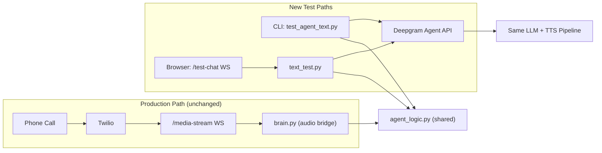

# Walkthrough: Hybrid Text-Testing System

## What Was Built

A text-based testing interface for the Deepgram AI receptionist agent (Sarah), allowing you to test and iterate on agent responses **without making phone calls**. Uses Deepgram's official `InjectUserMessage` API, so text input goes through the exact same agent pipeline as voice calls.

## Architecture



## Files Changed

### New Files

| File | Purpose |
|---|---|
| [agent_logic.py](file:///e:/AI_and_Beyond/AI-Receptionist/ai-receptionist/services/agent_logic.py) | Shared response processing logic (recap extraction, availability checking, booking) |
| [conversation_logger.py](file:///e:/AI_and_Beyond/AI-Receptionist/ai-receptionist/services/conversation_logger.py) | Timestamped conversation transcript writer |
| [text_test.py](file:///e:/AI_and_Beyond/AI-Receptionist/ai-receptionist/routers/text_test.py) | FastAPI WebSocket endpoint `/test-chat` for browser-based text testing |
| [test_agent_text.py](file:///e:/AI_and_Beyond/AI-Receptionist/ai-receptionist/tests/test_agent_text.py) | Standalone CLI test harness |
| [test_chat.html](file:///e:/AI_and_Beyond/AI-Receptionist/ai-receptionist/static/test_chat.html) | Browser chat UI for the text test endpoint |

### Modified Files

| File | What Changed |
|---|---|
| [brain.py](file:///e:/AI_and_Beyond/AI-Receptionist/ai-receptionist/routers/brain.py) | Refactored to delegate response processing to `agent_logic.py`. Audio bridging unchanged. |
| [main.py](file:///e:/AI_and_Beyond/AI-Receptionist/ai-receptionist/main.py) | Added `text_test` router and static file serving |
| [.gitignore](file:///e:/AI_and_Beyond/AI-Receptionist/ai-receptionist/.gitignore) | Exclude conversation logs, allow test scripts; fixed merge conflict marker |

## How to Use

### Option 1: CLI Test Harness (Fastest)

```bash
cd e:\AI_and_Beyond\AI-Receptionist\ai-receptionist
python tests/test_agent_text.py
```

Type messages, see Sarah's responses. Type `quit` to exit. Conversation is auto-logged.

### Option 2: Browser Chat Page

1. Start the server:
```bash
python main.py
```

2. Open in browser: **http://localhost:8000/static/test_chat.html**

3. Chat with Sarah in the text interface.

### Option 3: WebSocket API (for Antigravity/automation)

Connect a WebSocket client to `ws://localhost:8000/test-chat` and send:
```json
{"text": "I would like to book an appointment"}
```

Receive responses:
```json
{"role": "assistant", "content": "Of course! ..."}
```

## Key Design Decisions

1. **Uses `InjectUserMessage`** -- Deepgram's official text input API. Agent processes it identically to spoken audio. No mocking or bypassing.

2. **Audio discarded in text mode** -- Deepgram still generates TTS audio, but the text test paths ignore it and only forward `ConversationText` events.

3. **Shared logic via `agent_logic.py`** -- Recap extraction, early availability check, and booking trigger are in one place. Both voice and text paths call the same functions.

4. **Zero changes to production voice path** -- The Twilio call flow is untouched. `brain.py` still handles audio bridging exactly as before; it just delegates text processing to the shared module.

## Verification

- All module imports verified
- `main.py` loads without errors  
- Server starts and serves all endpoints
- Conversation logs are written to `tests/conversation_logs/`
