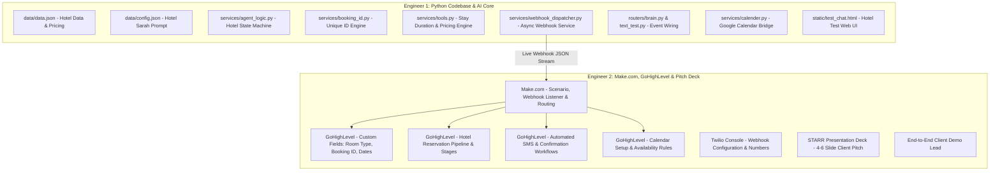

# Implementation Plan: Hotel AI Receptionist Transformation & Make.com / GoHighLevel Integration

This plan outlines the end-to-end transformation of the current AI Receptionist from a dental clinic assistant into a **Hotel AI Receptionist** powered by an event-driven Webhook architecture (Model A) connected to **Make.com** and **GoHighLevel (GHL)**. It includes a structured Phase 0 pre-flight setup divided cleanly between two engineers, a balanced 50/50 workload division for implementation, a progress tracking specification, and a 4-6 slide STARR pitch presentation outline.

---

## Phase 0: Pre-Flight Configuration, Credentials & Platform Setup

Before starting codebase refactoring and automation scenario building, fresh credentials, environment variables, and third-party platform integrations must be provisioned and divided cleanly between both engineers.

### 1. Phase 0 Workload Matrix

| Area | Engineer 1 (Python Core & Local AI Engine) | Engineer 2 (Cloud Automations, GHL & Telephony) |
| :--- | :--- | :--- |
| **API Keys & Credentials** | Generate `DEEPGRAM_API_KEY`, optional `TURSO_*` / Google Calendar credentials | Provision Twilio Account/Phone, GoHighLevel API Key/Token & `GHL_LOCATION_ID` |
| **Cloud Webhooks** | Define & document outbound JSON payload contracts (`booking.created`, `call.completed`) | Provision Make.com Scenario, create Custom Webhook Listener, provide `MAKE_WEBHOOK_URL` |
| **Network & Telephony** | Configure local server port/host (`PORT=8000`, `HOST=0.0.0.0`) | Setup Ngrok/Tunneling (`PUBLIC_BASE_URL`), configure Twilio Voice Webhook to `/incoming-call` |
| **CRM & SMS Setup** | - | Create GHL Custom Fields, "Hotel Reservations" Pipeline, and automated SMS template |
| **Environment & Git** | Setup virtual environment `AI-Receptionist-2-0`, install `requirements.txt`, update `.env.example` | Validate `.env` variables for GHL/Make/Twilio with Engineer 1 |

---

### 2. Detailed Phase 0 Task Breakdown

#### Engineer 1: Python Core & Local Environment Setup
1. **Python Virtual Environment & Dependencies**:
   - Create and activate virtual environment named `AI-Receptionist-2-0`:
     ```powershell
     python -m venv AI-Receptionist-2-0
     .\AI-Receptionist-2-0\Scripts\Activate.ps1
     pip install -r requirements.txt
     ```
   - Verify all required libraries (`fastapi`, `uvicorn`, `websockets`, `httpx`, `python-dotenv`) are installed and functional.
2. **Deepgram Voice Engine Provisioning**:
   - Generate fresh Deepgram API key (`DEEPGRAM_API_KEY`) with permissions for Voice Agent API (Nova-2 STT, Aura TTS).
3. **Local `.env` Configuration & Payload Contract Documentation**:
   - Initialize `.env` from [.env.example](file:///e:/Murad-and-Ahad-DUO/AI-Receptionist-2-0/.env.example).
   - Document JSON payload structure for `booking.created` and `call.completed` to hand off to Engineer 2.
4. **Google Cloud & Database Fallbacks (Optional)**:
   - Prepare `credentials.json` if Google Calendar synchronization is enabled.
   - Configure `TURSO_DATABASE_URL` and `TURSO_AUTH_TOKEN` if using cloud SQLite.

---

#### Engineer 2: Cloud Automations, Telephony & CRM Setup
1. **Telephony & Tunneling Setup**:
   - Set up and run Ngrok or Cloudflare Tunnel to expose port 8000 (`ngrok http 8000`) and obtain `PUBLIC_BASE_URL`.
   - Provision a fresh voice-enabled Twilio phone number.
   - Configure Twilio Voice Webhook to `https://<PUBLIC_BASE_URL>/incoming-call` (HTTP POST).
2. **Make.com Webhook Listener Scenario**:
   - Create Make.com scenario: `Hotel AI Receptionist - Pipeline Sync & SMS Trigger`.
   - Add **Custom Webhook** module to generate the webhook listener URL.
   - Deliver `MAKE_WEBHOOK_URL` to Engineer 1 for the `.env` file.
3. **GoHighLevel (GHL) Sub-Account & Pipeline Provisioning**:
   - Retrieve `GHL_LOCATION_ID` and generate API Key / Private Integration Token (`GHL_API_KEY`).
   - Create Custom Contact Fields in GHL:
     - `Booking ID` (Single Line Text)
     - `Room Type` (Dropdown: Standard Queen, Deluxe King, Executive Suite, Penthouse)
     - `Check-in Date` (Date)
     - `Check-out Date` (Date)
     - `Number of Guests` (Number)
     - `Total Cost` (Monetary / Number)
     - `Special Requests` (Large Text)
   - Create Opportunity Pipeline: `Hotel Reservations` (Stages: `Inquiry` $\rightarrow$ `Reserved` $\rightarrow$ `Checked In` $\rightarrow$ `Checked Out` $\rightarrow$ `Cancelled`).
   - Create Automated SMS Workflow triggered upon reservation creation with dynamic `{{contact.booking_id}}`.

---

### 3. Unified Environment Schema (`.env`)

```env
# --- Core Voice & AI Engine (Engineer 1) ---
DEEPGRAM_API_KEY=your_fresh_deepgram_api_key

# --- Webhook Dispatcher (Engineer 2 -> Engineer 1) ---
MAKE_WEBHOOK_URL=https://hook.us1.make.com/your_make_webhook_id

# --- GoHighLevel Integration (Engineer 2) ---
GHL_LOCATION_ID=your_ghl_location_id
GHL_API_KEY=your_ghl_api_key

# --- Server & Tunneling Settings (Joint) ---
PORT=8000
HOST=0.0.0.0
PUBLIC_BASE_URL=https://your-ngrok-or-tunnel-domain.ngrok-free.app

# --- Database Storage (Optional / Cloud Sync) ---
TURSO_DATABASE_URL=
TURSO_AUTH_TOKEN=
```

---

## Balanced 50/50 Work Division Strategy

To prevent overloading and eliminate Git merge conflicts, implementation responsibilities are partitioned between **Python Codebase & AI Backend (Engineer 1)** and **Cloud Automations, CRM Architecture & Client Pitch (Engineer 2)**.



---

### Detailed Task Breakdown

#### Engineer 1: Python Codebase & AI Backend Engineer
*Owns 100% of the Python code and Git repository.*

1. **Hotel Domain Knowledge & Prompting**:
   - Refactor `data/data.json` with hotel details (room categories, pricing, amenities, check-in/out policies, FAQs).
   - Update `data/config.json` with Hotel Sarah prompt, room booking function definition, and confirmation protocol.
2. **Hotel Conversation State & Booking Logic**:
   - Refactor `services/agent_logic.py` for hotel fields: `guest_name`, `phone_number`, `room_type`, `check_in_date`, `check_out_date`, `number_of_guests`, `special_requests`.
   - Create `services/booking_id.py` to generate unique confirmation IDs (e.g., `HTL-8492X`).
   - Implement stay duration (number of nights) and total cost calculation in `services/tools.py`.
3. **Webhook Dispatcher & Pipeline Integration**:
   - Create `services/webhook_dispatcher.py` for non-blocking asynchronous HTTP POST delivery to Make.com.
   - Wire event triggers for `booking.created` and `call.completed` in `routers/brain.py` and `routers/text_test.py`.
4. **Calendar Bridge & Web UI**:
   - Refactor `services/calender.py` for Google Calendar synchronization fallback.
   - Update `static/test_chat.html` theme, quick-action buttons, and conversation test flows for hotel reservations.

---

#### Engineer 2: Cloud Automations, GoHighLevel CRM Architect & Pitch Lead
*Owns Make.com, GoHighLevel sub-account setup, SMS automations, and Client Presentation.*

1. **Make.com Scenario Engineering**:
   - Set up Webhook Listener module to ingest payloads from the Python server.
   - Create Router branches for `booking.created` vs `call.completed`.
   - Configure data mapping, formatting, and error handling.
2. **GoHighLevel CRM & Pipeline Architecture**:
   - Create Custom Contact Fields: `Booking ID`, `Room Type`, `Check-in Date`, `Check-out Date`, `Total Cost`, `Number of Guests`.
   - Build a "Hotel Reservations" Pipeline (Stages: *Inquiry*, *Reserved*, *Checked In*, *Checked Out*, *Cancelled*).
   - Configure GoHighLevel Calendar for room/staff schedules.
3. **Automated SMS Confirmation Workflow**:
   - Build automated GoHighLevel Workflow triggered upon reservation creation.
   - Format instant SMS template:
     `"Hello {{contact.first_name}}, your reservation at Grand Horizon Hotel is confirmed! Booking ID: {{contact.booking_id}}. Room: {{contact.room_type}}. Check-in: {{contact.check_in_date}} at 3:00 PM. Please present your Booking ID upon arrival."`
4. **Client Pitch Deck & Presentation (STARR)**:
   - Build the 4-6 slide STARR presentation deck.
   - Document client ROI metrics (direct bookings, zero missed calls, automated check-in).
   - Lead the live client demo walkthrough.

---

## `progress.md` Specification

```markdown
# Hotel AI Receptionist - Development Progress Tracker

## Phase 0: Pre-Flight Configuration (Track 0A - Engineer 1)
- [ ] [TODO] Set up Python virtual environment `AI-Receptionist-2-0` and verify dependencies
- [ ] [TODO] Generate fresh Deepgram API key and configure in `.env`
- [ ] [TODO] Document outbound JSON webhook payload contracts (`booking.created`, `call.completed`)
- [ ] [TODO] Configure local server settings (`PORT=8000`, `HOST=0.0.0.0`) in `.env`

## Phase 0: Pre-Flight Configuration (Track 0B - Engineer 2)
- [ ] [TODO] Set up Ngrok / Cloudflared public tunnel and configure `PUBLIC_BASE_URL`
- [ ] [TODO] Provision Twilio voice phone number and configure webhook to `<PUBLIC_BASE_URL>/incoming-call`
- [ ] [TODO] Create Make.com scenario webhook listener and share `MAKE_WEBHOOK_URL`
- [ ] [TODO] Generate GHL API key / private token and retrieve `GHL_LOCATION_ID`
- [ ] [TODO] Create GHL custom contact fields (Booking ID, Room Type, Check-in, Check-out, Total Cost)
- [ ] [TODO] Build GHL "Hotel Reservations" Pipeline and stages
- [ ] [TODO] Configure GHL automated SMS reservation confirmation workflow

## Track A: Python Codebase & AI Core (Engineer 1)
- [ ] [TODO] Define hotel metadata, room tiers, rates, and policies in `data/data.json`
- [ ] [TODO] Rewrite system prompt for Hotel Sarah in `data/config.json`
- [ ] [TODO] Implement hotel booking state machine in `services/agent_logic.py`
- [ ] [TODO] Implement unique booking ID generator in `services/booking_id.py`
- [ ] [TODO] Implement stay duration and pricing calculation helper in `services/tools.py`
- [ ] [TODO] Create asynchronous webhook dispatcher in `services/webhook_dispatcher.py`
- [ ] [TODO] Hook `booking.created` and `call.completed` into `routers/brain.py` and `routers/text_test.py`
- [ ] [TODO] Update web chat testing interface in `static/test_chat.html`
- [ ] [TODO] Google Calendar API synchronization bridge in `services/calender.py`

## Track B: Cloud Automations, GHL & Presentation (Engineer 2)
- [ ] [TODO] Build Make.com scenario routing (`booking.created` and `call.completed`)
- [ ] [TODO] Map Make.com data to GoHighLevel Contact and Opportunity records
- [ ] [TODO] Test automated GoHighLevel SMS workflow with dynamic Booking ID
- [ ] [TODO] Configure GoHighLevel Calendar and staff availability rules
- [ ] [TODO] Build 4-6 slide STARR presentation deck for client pitch
- [ ] [TODO] Lead live demo walkthrough test

## Track C: Joint Verification
- [ ] [TODO] End-to-end web chat reservation -> Make.com -> GHL Contact -> SMS verification received
- [ ] [TODO] End-to-end phone call reservation -> Voice booking -> GHL Opportunity -> SMS verification received
```

---

## STARR Presentation Outline (4-6 Slides for Client Showcase)

### Slide 1: Situation (The Front Desk Bottleneck in Hospitality)
- **Problem**: 30-35% of hotel inquiry and reservation calls go unanswered during peak check-in rushes and night shifts.
- **Impact**: Lost direct bookings and heavy reliance on 15-25% OTA commissions.

### Slide 2: Task (The 24/7 Autonomous Concierge Objective)
- **Objective**: Deploy an intelligent voice AI capable of answering instantly, checking room availability, answering hotel policy questions, and confirming reservations 24/7/365.

### Slide 3: Action (The AI & CRM Architecture)
- **Technology**: Sub-second Deepgram Voice AI + GPT-4o-mini reasoning connected via real-time Webhooks to Make.com and GoHighLevel CRM with instant SMS verification ID dispatch.

### Slide 4: Result (Operational Impact & ROI)
- **Metrics**: 100% call answer rate, 70%+ front desk workload reduction, increased direct booking revenue, and friction-free check-in.

### Slide 5: Reflection & Future Expansion
- **Growth**: In-stay WhatsApp concierge for room service/housekeeping, multi-language international guest support, and automated upselling (spa, dining, airport shuttles).

### Slide 6: Visual System Flow Demo
- **Diagram**: Guest Call $\rightarrow$ Voice AI Receptionist $\rightarrow$ Make.com Webhook $\rightarrow$ GoHighLevel Pipeline $\rightarrow$ Instant SMS Confirmation with Booking ID.
